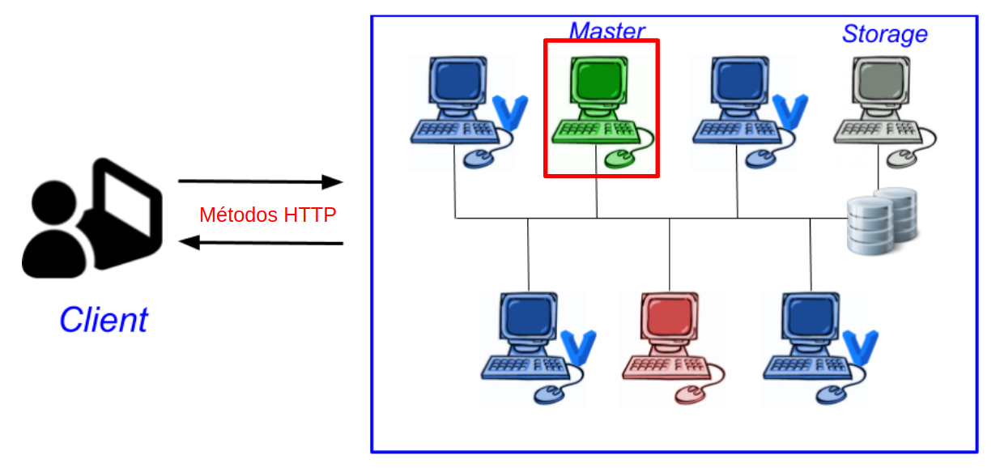

# Flask-Vagrant-RC_cluster

Este repositorio es un proyecto pensado para gestion del despliegue de maquinas virtuales en un cluster usando vagrant. el proposito de esta herremienta es automatizar el despliegue de maquina virtuales de manera remota usando un micro-framework escrito en python llamado Flask.

# Requerimientos

Para llevar a cabo este proyecto se requiere:

 - Tener conocimientos de comandos de Linux para extraer información del sistema.
 - Tener conocimientos de Python pues es el lenguaje en el que se han desarrollado los scripts de este repositorio.
 - Tener conocimientos de Virtualización en particular de las herramientas VirtualBox y Vagrant.
 - Tener conocimientos de Web Services y un conocimiento del microframework Flask.

# ¿Como usar?

para usar este proyecto:

- Se debe crear un Dir. en ~/.vagrantservice (Directorio de confg)
- Se debe crear un Arc. en ~/.vagrantservice/DB.json (DB)
- Se debe crear un Dir. en ~/vagrant  (Directorio de proyecto)
